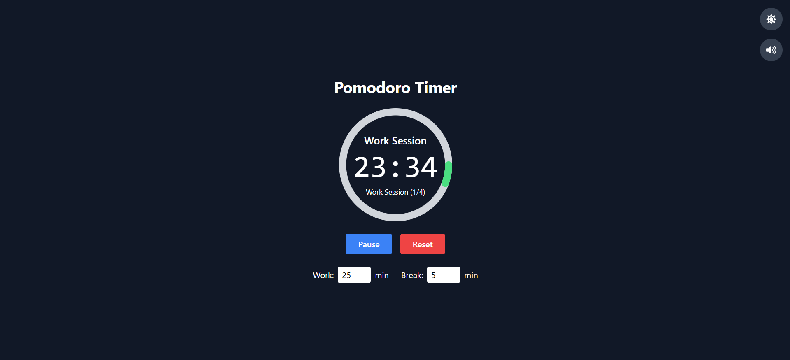

# ⏳ Pomodoro Timer

A simple and modern Pomodoro Timer built with **React** and **Tailwind CSS**, featuring dark mode, sound alerts, and customizable session controls.

---

## 🚀 Features

* **Pomodoro Technique**: Stay focused with a 25/5-minute timer cycle.
* **Dark / Light Mode**: Toggle between themes with one click.
* **Sound Alerts**: Play a beep sound when the timer ends (toggle on/off).
* **Responsive Design**: Works perfectly on desktop and mobile.
* **Custom Controls**: Start, pause, reset, and adjust session/break times.

---

## 🖥️ Tech Stack

* **Frontend**: React + Vite
* **Styling**: Tailwind CSS
* **Icons**: react-icons
* **Sound**: HTML5 Audio API

---

## 🌐 Live Demo
🔗 **[View on Vercel](https://pomodoro-timer-anjalee-amarakoons-projects.vercel.app/)**

---

## 📷 Preview



---

## ⚙️ Installation

```bash
# Clone the repository
git clone https://github.com/your-username/pomodoro-timer.git

# Navigate to the project
cd pomodoro-timer

# Install dependencies
npm install

# Run the development server
npm run dev
```

---

## 🎯 Usage

1. **Start**: Click the play button to start the timer.
2. **Pause**: Pause the session anytime.
3. **Reset**: Reset to the default session/break time.
4. **Dark Mode**: Click the theme toggle icon to switch between dark and light mode.
5. **Sound**: Toggle the sound icon to enable or mute alerts.

---

## 📂 Project Structure

```
pomodoro-timer/
│── public/
│   └── beep.mp3
│── src/
│   ├── components/
│   ├── App.jsx
│   ├── index.css
│   └── main.jsx
│── package.json
└── README.md
```

